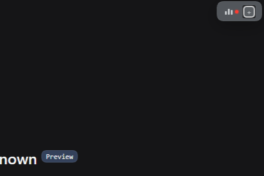
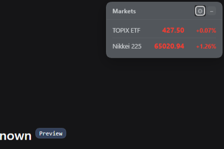
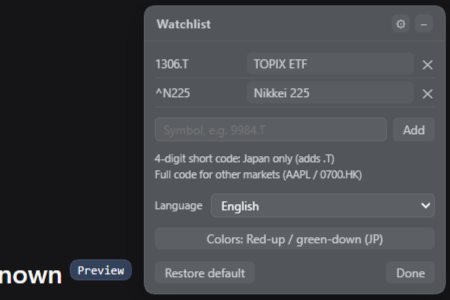

# 🧩 dsh-ticker-jp

English · [简体中文](./README.md)

[](LICENSE)
[](https://www.npmjs.com/package/dsh-ticker-jp)
[](https://awesome-dsh-plugin.com)

A small floating ticker for the top-right corner of DeepSeek Harness. It shows the TOPIX-linked ETF and the Nikkei 225, and you can watch any Yahoo symbol with a custom display name. Forked from [dsh-stock-ticker](https://github.com/FeiZhuNiU-INFJA/dsh-stock-ticker): the floating-window interaction comes from upstream, while the data source was switched to Yahoo Finance to cover Japanese markets.

## 📸 Preview

<p align="center">
  
  
  
</p>

## ✨ Features

- Draggable, collapsible window that follows the DSH theme
- One row per symbol: name, price, change percent; red for up by default
- Watch any Yahoo symbol, with 4-digit shorthand and `code:display name` aliases
- Smart polling: when every watched market is closed, it checks once a minute instead of every 5 seconds
- Up/down colors switchable between Japanese and US conventions
- 16 UI languages, auto-detected from the browser on first run, changeable any time
- Window position, watchlist, palette and language all persist locally
- One-click restore to defaults

### Default symbols

| Display   | Code     | Note                                                                      |
| --------- | -------- | ------------------------------------------------------------------------- |
| TOPIX ETF | `1306.T` | Yahoo no longer serves the TOPIX index, so its linked ETF is used instead |
| 日経225   | `^N225`  | The Nikkei 225 index                                                      |

## 🚀 Install

Install from npm (prebuilt, no build approval needed), or straight from the GitHub source:

```bash
# npm (recommended)
dsh plugin --profile web add dsh-ticker-jp

# GitHub source
dsh plugin --profile web add github:MurasakiIzumi/dsh-ticker-jp
```

Restart DSH (or choose "restart now") and the widget appears at the top-right of the page.

## ⚙️ Usage

1. Click the **⚙** button in the title bar to open settings.
2. Each row is code + display-name input + remove button. Editing the name applies immediately; leaving it blank falls back to built-in shorthand → Yahoo name → code.
3. Use the box at the bottom to add symbols: `9984.T`, `AAPL`, or `9984` (a bare 4-digit code gets `.T` appended, Japan only). `9984.T:软银` adds a symbol with an alias.
4. Palette and language controls sit in the middle of the panel and apply immediately.
5. "Restore default" returns to TOPIX ETF + Nikkei 225; "Done" closes the panel.

## 🗂️ Code structure

```
dsh-ticker-jp/
├── lib/index.js       # Host: registers the /dsh-ticker-jp/quotes route
├── lib/client.js      # Client: widget UI, polling, watchlist/aliases
├── lib/index.d.ts     # Host type declarations
├── lib/client.d.ts    # Client type declarations
├── host.js            # Dynamic-plugin host half (optional)
├── client.js          # Dynamic-plugin client half (optional)
├── package.json       # Package manifest
├── cordis.patch.yml   # Bundle patch
├── CHANGELOG.md       # Changelog
├── assets/            # Screenshots
├── LICENSE
├── README.md          # 中文说明 (Chinese)
└── README.en.md       # English
```

The same code ships in two forms: `lib/` is the bundle that stays installed in DSH; `host.js` / `client.js` form the dynamic-plugin variant for temporary runs. They are functionally equivalent.

## 🔌 Data source

- Yahoo Finance chart API: `https://query1.finance.yahoo.com/v8/finance/chart/{code}?interval=1d&range=1d`
- Free, no authentication. Price from `meta.regularMarketPrice`, change percent from `meta.regularMarketChangePercent`, name from `longName/shortName`
- Covers major markets worldwide: Japan `.T`, US, Hong Kong `.HK`, China `.SS/.SZ`
- Each quote carries the exchange timezone and exchange name so the client can tell when local markets trade
- Names come from Yahoo, never a built-in table; the two defaults get shorthand names in the display layer only

## 🧪 Dynamic plugin (optional)

Loads without installing, for a quick trial:

1. Create a plugin with `cordis_define`: paste [host.js](./host.js) as `code.host` and [client.js](./client.js) as `code.client`.
2. Activate with `cordis_run`; approve the client on first run.
3. Refresh the page to see the widget.

The dynamic form behaves like the bundle. The only difference is the Host fetch path: the dynamic Host runs in a restricted sandbox and fetches through `ctx.web`, while the bundle uses native `fetch`. The RPC contract is the same.

## 📄 License

[MIT](./LICENSE)

The floating-window implementation and structure come from [FeiZhuNiU-INFJA](https://github.com/FeiZhuNiU-INFJA)'s [dsh-stock-ticker](https://github.com/FeiZhuNiU-INFJA/dsh-stock-ticker) (Copyright (c) 2026 Yulin). This fork replaces the data source and adds the watchlist feature (Copyright (c) 2026 XuZhichao).
