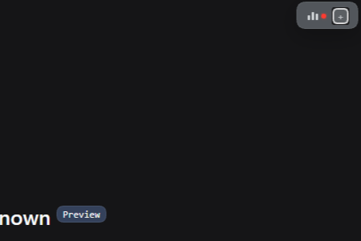
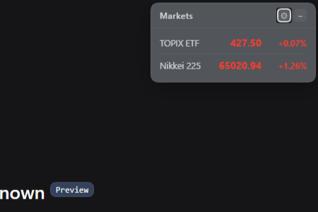
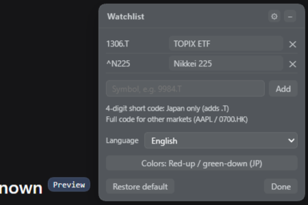

# 🧩 dsh-ticker-jp（日株＆全世界株に対応）

[English](./README.md) · [简体中文](./README.zh-CN.md) · **日本語**

[](https://awesome-dsh-plugin.com)
[](LICENSE)
[](https://www.npmjs.com/package/dsh-ticker-jp)
[](https://www.dsh.so/artifact/dsh-ticker-jp/)
[](https://www.dsh.so/artifact/dsh-ticker-jp/)

DeepSeek Harness の右上隅に表示するドラッグ可能な小型株価チッカーです。初期状態では**日経225（`^N225`）と TOPIX 連動 ETF（`1306.T`）**を表示し、4桁略号の `.T` 自動補完など日本株（`.T` コード）を第一にサポート。さらに Yahoo Finance の全コードに対応しているため、米国株・香港株（`.HK`）・中国本土株（`.SS`/`.SZ`）など**世界各国の株式市場**も自由にウォッチリストへ追加してリアルタイムで確認できます。元は [dsh-stock-ticker](https://github.com/FeiZhuNiU-INFJA/dsh-stock-ticker) のフォークで、フローティングウィンドウの操作系は元プロジェクトを踏襲しつつ、データソースを Yahoo Finance へ切り替えて日本株と世界株の両方に対応しました。

## 📸 プレビュー

<p align="center">
  
  
  
</p>

## ✨ 機能

- ドラッグ・折りたたみ可能なウィンドウ（DSH のテーマカラーに追従）
- 各行に銘柄名・価格・騰落率を表示（初期配色は日本式の赤↑/緑↓）
- 日本株 `.T`・米国株・香港株 `.HK`・中国本土株 `.SS`/`.SZ` など世界中の銘柄をウォッチリストに追加可能。4桁略号の `.T` 自動補完と `コード:表示名` エイリアスに対応
- スマートポーリング：ウォッチ中の全市場が休場のときは 1 分間隔に自動減速し、取引時間中は 5 秒間隔で更新
- 騰落の配色を日本式 / 米国式で切り替え可能
- UI は 16 言語。初回はブラウザ言語で自動選択され、いつでも変更可能
- ウィンドウ位置・折りたたみ状態・ウォッチリスト・配色・言語はすべてローカルに保存
- ワンクリックで初期状態に戻せる

### デフォルトの銘柄

| 表示名    | コード   | 備考                                                      |
| --------- | -------- | --------------------------------------------------------- |
| TOPIX ETF | `1306.T` | Yahoo の TOPIX 指数 API は更新停止のため、連動 ETF で代替 |
| 日経225   | `^N225`  | 日経平均株価指数                                          |

## 📋 動作環境

| 項目    | 要件                                             |
| ------- | ------------------------------------------------ |
| DSH     | `>=0.1.0-rc.7 <0.2.0`（`0.1.7-rc.2` で確認済み） |
| Node.js | `^22.19.0` または `>=24.0.0`                      |

`engines.dsh` と peer 依存 `@deepseek-ai/dsh-client-ui-slots` で宣言しています。その他の DSH 側パッケージは不要です。

## 🚀 インストール

npm から（ビルド済み・ビルド承認不要）、または GitHub ソースから直接インストールできます：

```bash
# npm（推奨）
dsh plugin --profile web add dsh-ticker-jp

# GitHub ソース
dsh plugin --profile web add github:MurasakiIzumi/dsh-ticker-jp
```

インストール後 DSH を再起動（または「今すぐ再起動」を選択）すると、ウィジェットがページ右上に表示されます。

## ⚙️ 使い方

1. タイトルバーの **⚙** をクリックして設定を開きます。
2. 各行は「コード＋表示名＋削除ボタン」。表示名の編集は即時反映され、空欄のときは「内蔵の略称 → Yahoo の銘柄名 → コード」の順にフォールバックします。
3. 下部の入力欄で銘柄を追加：`9984.T`、`AAPL`、`9984`（4桁の数字のみは日本株として `.T` を自動補完）、またはエイリアス付きの `9984.T:ソフトバンク`。
4. 配色と言語はパネル中央で切り替えられ、即時反映されます。
5. 「初期化」で TOPIX ETF ＋ 日経225 に戻り、「完了」でパネルを閉じます。

## 🗂️ コード構成

```
dsh-ticker-jp/
├── lib/index.js       # Host：/dsh-ticker-jp/quotes ルートを登録
├── lib/client.js      # Client：ウィジェット UI・ポーリング・ウォッチリスト/エイリアス
├── lib/index.d.ts     # Host の型定義
├── lib/client.d.ts    # Client の型定義
├── host.js            # 動的プラグインの Host 側（任意）
├── client.js          # 動的プラグインの Client 側（任意）
├── package.json       # パッケージマニフェスト
├── cordis.patch.yml   # bundle patch
├── CHANGELOG.md       # 変更履歴
├── assets/            # プレビュー画像
├── LICENSE
├── README.md          # English（メイン）
├── README.zh-CN.md    # 简体中文
└── README.ja.md       # 日本語
```

同一のコードが 2 形態で提供されます：`lib/` は DSH に常駐する bundle エントリー、`host.js` / `client.js` は一時的な体験用の動的プラグイン形態です。機能は同等です。

## 🔌 データソース

- Yahoo Finance chart API：`https://query1.finance.yahoo.com/v8/finance/chart/{コード}?interval=1d&range=1d`
- 無料・認証不要。価格は `meta.regularMarketPrice`、騰落率は `meta.regularMarketChangePercent`、銘柄名は `longName/shortName` を取得
- 世界の主要市場に対応：日本株 `.T`、米国株、香港株 `.HK`、中国本土株 `.SS`/`.SZ` など
- 各クオートに取引所のタイムゾーンと取引所名を同梱し、クライアントが現地の取引時間を判定
- 銘柄名は内蔵せず Yahoo の返却値を利用。デフォルト 2 銘柄の略称のみ表示レイヤーで上書き

## 🧪 動的プラグイン（任意）

インストールせず一時的に読み込む、クイック体験向けの方法です：

1. `cordis_define` でプラグインを作成：`code.host` に [host.js](./host.js) の全文、`code.client` に [client.js](./client.js) の全文を貼り付けます。
2. `cordis_run` で有効化し、初回実行時に承認カードで「許可」をクリックします。
3. ページをリロードするとウィジェットが表示されます。

動的形態の動作は bundle と同等です。違いは Host の取得経路のみ：動的形態は制限付きサンドボックス上で動くため `ctx.web` 経由で取得し、bundle はネイティブの `fetch` を使用します。RPC 契約は同一です。

## 📄 ライセンス

[MIT](./LICENSE)

フローティングウィンドウの実装と構造は [FeiZhuNiU-INFJA](https://github.com/FeiZhuNiU-INFJA) 氏の [dsh-stock-ticker](https://github.com/FeiZhuNiU-INFJA/dsh-stock-ticker)（Copyright (c) 2026 Yulin）に由来します。本フォークはデータソースの差し替え・ウォッチリスト機能の追加・世界市場への対応拡張を行っています（Copyright (c) 2026 XuZhichao）。
