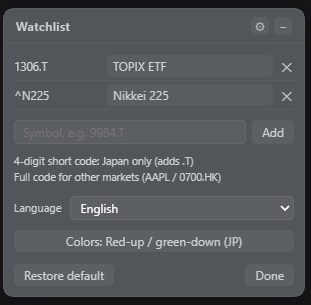

# 🧩 dsh-ticker-jp

> DeepSeek Harness 的悬浮行情插件（日股改版）：在页面右上角显示一个可拖拽、可收起的半透明小窗，实时展示 TOPIX 联动 ETF 与日经225，并可自选任意 Yahoo 代码（支持自定义显示名）。

<p align="center">
  <a href="./LICENSE"></a>
  
  
</p>

本项目是 [FeiZhuNiU-INFJA/dsh-stock-ticker](https://github.com/FeiZhuNiU-INFJA/dsh-stock-ticker) 的改版：
浮窗交互（拖拽、收起、5 秒轮询、跟随主题色）保留自上游，数据源由腾讯行情更换为 **Yahoo Finance** 以支持日本股市，并在此基础上新增了**自选行情与显示别名**功能。

## 📸 预览

<p align="center">
  
  
  
  
</p>

## ✨ 功能

### 继承自上游 dsh-stock-ticker

- 悬浮窗口，**可拖拽**、**可收起**
- 背景跟随 DeepSeek Harness 主题色（80% 透明度）
- 每 5 秒自动刷新，红涨绿跌
- 每个标的一行两项：**当前点位 + 涨跌幅**
- 代码名过长时省略号截断，悬停可查看 Yahoo 完整名称

### 本版新增 / 变更

- **数据源**：腾讯行情 → Yahoo Finance chart API，默认行情切换为日本市场
- **默认显示**（可随时恢复）：

  | 显示名    | 代码     | 说明                                                                                                 |
  | --------- | -------- | ---------------------------------------------------------------------------------------------------- |
  | TOPIX ETF | `1306.T` | Yahoo 无实时 TOPIX 指数本体（`^TPX` 已停更），故以 NEXT FUNDS TOPIX ETF 代替数据源，显示为 TOPIX ETF |
  | 日経225   | `^N225`  | 日经225 指数本体                                                                                     |

- **自选行情**：点击标题栏 ⚙ 打开自选面板，增删任意 Yahoo 代码
- **显示别名**：每个自选条目可带自定义显示名（行内直接编辑，或添加时写 `代码:显示名`），未设别名时按「内置简称 → Yahoo 名 → 代码」回退
- **4 位简码**：输入 `9984` 自动补全为 `9984.T`
- **本地持久化**：自选列表、窗口位置、涨跌配色与界面语言偏好都保存在浏览器 localStorage（动态插件形态可用时同样持久化）
- **窗口位置记忆**：拖拽悬浮窗后位置自动保存，下次启动自动回到上次位置
- **覆盖全球主要市场**：可添加任意 Yahoo 后缀的代码——日股 `9984.T`、美股 `AAPL`、港股 `0700.HK`、A股 `600519.SS` 等；4 位纯数字简码仅对日股自动补 `.T`
- **休市自动降频**：自选市场全部休市（周末或当地非交易时段）时暂停 5 秒轮询并保留最近数据，任一市场开盘后自动恢复；窗口建立时始终抓取一次快照
- **涨跌配色可配置**：⚙ 面板可切换「红涨绿跌（日式）」与「绿涨红跌（美式）」
- **多语言界面**：内置 简体中文 / 繁體中文 / English / 日本語，首次运行跟随浏览器语言，可在 ⚙ 面板下拉切换并保存；内建短名随语言本地化（如 Nikkei 225 / 日经225 / 日經225）
- **紧凑收起态**：窗口以右缘锚定，收起/展开切换时右侧按钮不动；收起后收缩为小胶囊（CSS 柱状行情图标 + 市场状态灯，绿=有市场在交易 / 红=全部休市），自动隐藏设置键
- **一键恢复默认**：回到 TOPIX ETF + 日経225

## 🚀 安装

作为常驻 bundle 安装，随 DSH 启动自动加载、重启不消失：

```bash
dsh plugin --profile web add github:MurasakiIzumi/dsh-ticker-jp
```

装完重启 DSH（或选择「立即重启」），页面右上角即出现悬浮行情窗。

> 结构遵循社区 `dsh-plugin` 约定：`dsh.bundle.patch` 指向 `cordis.patch.yml`，Host 入口 `lib/index.js` 注册同源路由 `/dsh-ticker-jp/quotes`（内部以原生 `fetch` 请求 Yahoo Finance），Client bundle `lib/client.js` 渲染悬浮窗并每 5 秒轮询该路由。

## ⚙️ 自选与别名

1. 点击悬浮窗标题栏的 **⚙** 进入自选设置
2. 列表每一行 = 代码 + 显示名输入框 + 移除按钮：
   - 直接在输入框内修改「显示名」即生效
   - 留空显示名时按默认简称 → Yahoo 名 → 代码的顺序回退
3. 底部输入框添加新标的，格式：
   - 纯代码：`9984.T`、`^N225`、`AAPL`、`0700.HK`、`600519.SS`
   - 4 位简码（仅日股）：`9984`（自动补 `.T`）；其它市场请输完整后缀
   - 带别名：`9984.T:软银`（冒号后可跟显示名，代码已存在时等价于改名）
4. 「恢复默认」回到 TOPIX ETF 与日経225，「完成」退出设置
5. 「涨跌配色」按钮位于自选面板内（提示行下方），点击在日式/美式配色间切换，即时生效并保存
6. 「语言」下拉在配色按钮上方：简体中文 / 繁體中文 / English / 日本語，切换即时生效并保存

## 🗂️ 代码结构

```
dsh-ticker-jp/
├── lib/index.js    # Host 包入口：注册 /dsh-ticker-jp/quotes 路由
├── lib/client.js   # Client bundle：悬浮窗 UI + 5s 轮询 + 自选/别名
├── host.js         # 动态插件 Host 半区（可选；沙箱内经 ctx.web 抓取，RPC 契约与 lib/index.js 一致）
├── client.js       # 动态插件形式的 Client 半区（可选，与 lib/client.js 逻辑等价）
├── package.json    # 包清单（dsh bundle + client 声明）
├── cordis.patch.yml  # bundle patch：插入插件行
├── assets/screenshot.png   # 悬浮行情预览
├── assets/screenshot2.png  # 自选行情设置预览
├── LICENSE
└── README.md
```

## 🔌 数据源

- 接口：`https://query1.finance.yahoo.com/v8/finance/chart/{代码}?interval=1d&range=1d`
- 免费、无需鉴权，返回 JSON（价格取自 `meta.regularMarketPrice`、涨跌幅取自 `meta.regularMarketChangePercent`、名称取自 `meta.longName/shortName`）
- **覆盖范围**：Yahoo chart API 覆盖全球主要市场——日股（`.T`、`^N225` 等指数）、美股（`AAPL`）、港股（`.HK`）、A股（`.SS`/`.SZ`）均可按需抓取
- **时区回传**：成功抓取时返回 Yahoo 的交易所时区（`exchangeTimezoneName`）与交易所名，客户端据此判断各市场当地交易时段，实现休市自动降频
- 名称**不在内置表中**（上游的中文命名表已移除），一律以 Yahoo 返回为准，缺名时回退完整代码；默认两只的简短显示名仅存在于 Client 展示层
- 说明：Yahoo 的 `^TPX`（TOPIX 指数）接口已停更（仅返回多年前的旧数据），因此默认用其联动 ETF `1306.T` 作为数据源，并以 **TOPIX ETF** 为显示名

## 🧪 动态插件（可选，临时体验）

不落盘、临时载入的动态插件方式，适合快速体验：

1. 让 agent 用动态插件工具 `cordis_define` 创建插件：
   - `code.host` 填 [`host.js`](./host.js) 的整段内容
   - `code.client` 填 [`client.js`](./client.js) 的整段内容

2. `cordis_run` 激活；客户端首次运行需要在审批卡片里点「允许」。
3. 刷新页面后即出现悬浮行情窗。

> 两个文件里的代码就是 `cordis_define` 的 `code.host` / `code.client` 函数体，直接整段复制即可；对外功能与 bundle 形态（`lib/`）等价——唯一差异是动态 Host 半运行于受限沙箱（原生 `fetch` 被禁用），抓取经 `ctx.web` 完成，而 bundle 仍用原生 `fetch`，两者的 RPC 契约一致。

## 📄 License

[MIT](./LICENSE)

特别感谢上游作者 [FeiZhuNiU-INFJA](https://github.com/FeiZhuNiU-INFJA) 及原项目 [dsh-stock-ticker](https://github.com/FeiZhuNiU-INFJA/dsh-stock-ticker)：本插件的悬浮窗实现与结构均源自该项目（Copyright (c) 2026 Yulin），我们在其 MIT 许可基础上修改数据源并扩展自选功能（Copyright (c) 2026 XuZhichao）。
