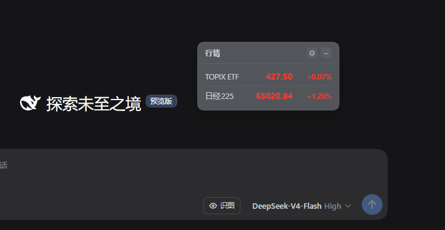
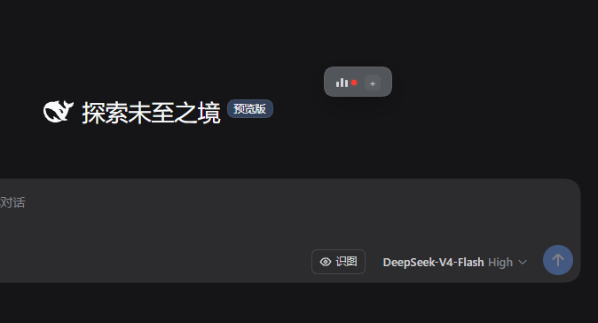
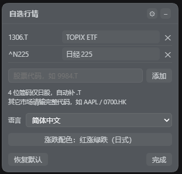

# 🧩 dsh-ticker-jp

**简体中文** · [English](./README.en.md)

<p align="center">
  <a href="./LICENSE"></a>
  
  
</p>

右上角的悬浮行情小窗，展示 TOPIX 联动 ETF 与日经225，可自选任意 Yahoo 代码。由 [dsh-stock-ticker](https://github.com/FeiZhuNiU-INFJA/dsh-stock-ticker) 改版而来，浮窗交互保留自上游，数据源换成 Yahoo Finance 以支持日股。

## 📸 预览

<p align="center">
  
  
  
</p>

## ✨ 功能

- 浮窗可拖拽、可收起，背景跟随 DSH 主题色
- 每行显示名称、价格、涨跌幅，红涨绿跌
- 自选任意 Yahoo 代码，支持 4 位简码与 `代码:显示名` 别名
- 休市自动降频：全部自选市场休市时改为每分钟检查，开盘恢复 5 秒刷新
- 涨跌配色可在日式/美式间切换
- 16 种界面语言，首次按浏览器语言匹配，随时可换
- 窗口位置、自选列表、配色、语言均保存在本地
- 一键恢复默认

### 默认标的

| 显示名    | 代码     | 说明                                             |
| --------- | -------- | ------------------------------------------------ |
| TOPIX ETF | `1306.T` | Yahoo 的 TOPIX 指数接口已停更，以其联动 ETF 代替 |
| 日経225   | `^N225`  | 日经225 指数本体                                 |

## 🚀 安装

从 npm 安装（预构建、免构建授权），或直接从 GitHub 源码安装：

```bash
# npm（推荐）
dsh plugin --profile web add dsh-ticker-jp

# GitHub 源码
dsh plugin --profile web add github:MurasakiIzumi/dsh-ticker-jp
```

装完重启 DSH（或选「立即重启」），窗口出现在页面右上角。

## ⚙️ 使用

1. 点标题栏 **⚙** 进入设置。
2. 每行是代码 + 显示名 + 移除按钮。直接改显示名即生效；留空则按默认简称 → Yahoo 名 → 代码回退。
3. 底部输入框添加标的，可填 `9984.T`、`AAPL`、`9984`（4 位纯数字只对日股补 `.T`）或带别名的 `9984.T:软银`。
4. 配色与语言在面板中部切换，即时生效。
5. 「恢复默认」回到 TOPIX ETF 与日経225，「完成」退出。

## 🗂️ 代码结构

```
dsh-ticker-jp/
├── lib/index.js       # Host：注册 /dsh-ticker-jp/quotes 路由
├── lib/client.js      # Client：悬浮窗 UI、轮询、自选/别名
├── lib/index.d.ts     # Host 类型声明
├── lib/client.d.ts    # Client 类型声明
├── host.js            # 动态插件 Host 半区（可选）
├── client.js          # 动态插件 Client 半区（可选）
├── package.json       # 包清单
├── cordis.patch.yml   # bundle patch
├── CHANGELOG.md       # 变更记录
├── assets/            # 预览截图
├── LICENSE
├── README.md          # 中文说明
└── README.en.md       # English
```

同一份代码有两种形态：`lib/` 是随 DSH 常驻的 bundle 入口；`host.js` / `client.js` 是动态插件形态，临时体验用，功能等价。

## 🔌 数据源

- Yahoo Finance chart API：`https://query1.finance.yahoo.com/v8/finance/chart/{代码}?interval=1d&range=1d`
- 免费、无需鉴权。价格取 `meta.regularMarketPrice`，涨跌幅取 `meta.regularMarketChangePercent`，名称取 `longName/shortName`
- 覆盖全球主要市场：日股 `.T`、美股、港股 `.HK`、A股 `.SS/.SZ` 均可
- 抓取时回传交易所时区与交易所名，客户端据此判断当地交易时段
- 名称不内置，以 Yahoo 返回为准；默认两只的简称只在展示层覆盖

## 🧪 动态插件（可选）

不落盘、临时载入，适合快速体验：

1. 用 `cordis_define` 创建插件：`code.host` 填 [host.js](./host.js) 全文，`code.client` 填 [client.js](./client.js) 全文。
2. `cordis_run` 激活，客户端首次运行在审批卡片点「允许」。
3. 刷新页面即出现悬浮窗。

动态形态与 bundle 功能一致，差别只在 Host 抓取方式：动态形态运行在受限沙箱，经 `ctx.web` 抓取；bundle 用原生 `fetch`。两者的 RPC 契约相同。

## 📄 License

[MIT](./LICENSE)

悬浮窗实现与结构源自 [FeiZhuNiU-INFJA](https://github.com/FeiZhuNiU-INFJA) 的 [dsh-stock-ticker](https://github.com/FeiZhuNiU-INFJA/dsh-stock-ticker)（Copyright (c) 2026 Yulin），本改版修改数据源并扩展自选功能（Copyright (c) 2026 XuZhichao）。
